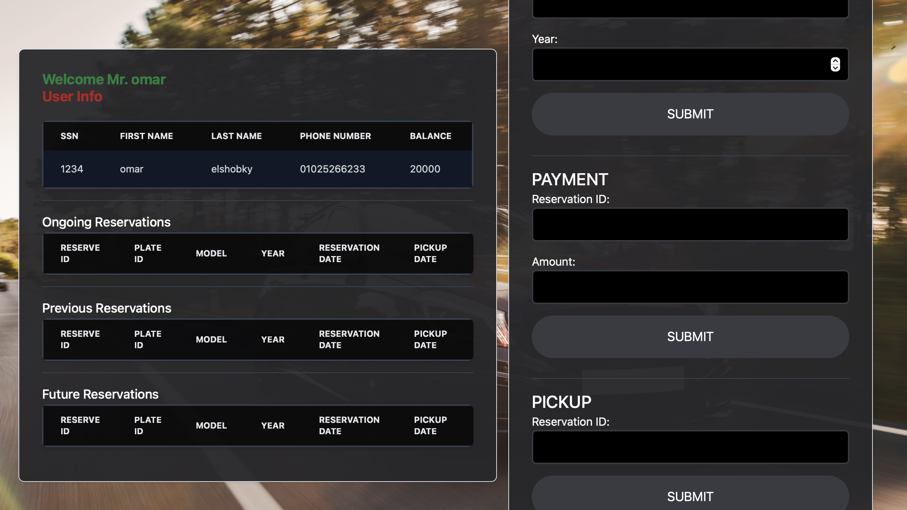
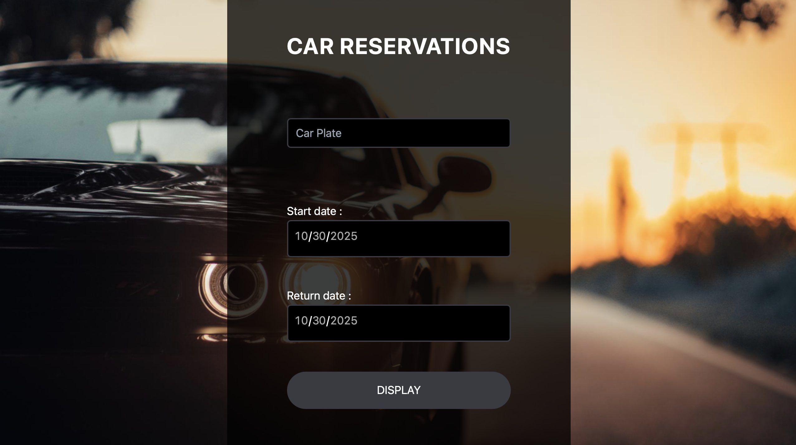

# 🚗 Car Rental System

A full-stack **Car Rental System** that allows users to browse, book, and manage car rentals, while admins oversee the entire system — including vehicle management, user control, and rental analytics.

---

## 🧩 Features
- 🔑 User authentication (sign up / login)
- 🚘 Car browsing and booking
- 📅 Reservation management
- 🧑‍💼 Admin dashboard to manage cars, users, and bookings
- 📊 Rental analytics and reports

---

## 👥 User View

Below are snapshots from the **user side** of the application.

| Home Page |
|------------|
|  |

🧭 The user can:
- View available cars
- Filter by type or availability
- Book cars and manage their rentals easily

---

## 🛠️ Admin View

The **Admin Dashboard** provides full control over the platform.

| Dashboard | Manage Cars | Manage Users |
|------------|--------------|--------------|
|  |  |  |

| Bookings Overview | Reports | Settings | Analytics |
|--------------------|----------|-----------|------------|
|  |  |  |  |

💼 The admin can:
- Add, update, or delete cars  
- View all bookings and users  
- Access detailed rental statistics  

---

## ⚙️ Tech Stack
- **Frontend:** HTML, CSS, JavaScript (or React if applicable)
- **Backend:** Node.js / Express (or your backend)
- **Database:** MySQL / MongoDB
- **Version Control:** Git & GitHub

---

## 🚀 Getting Started
1. Clone the repository:
   ```bash
   git clone https://github.com/YOUR_USERNAME/Car-Rental-System.git
